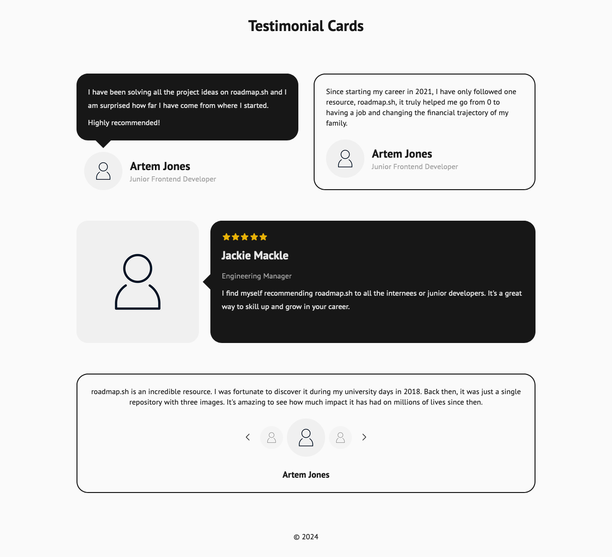
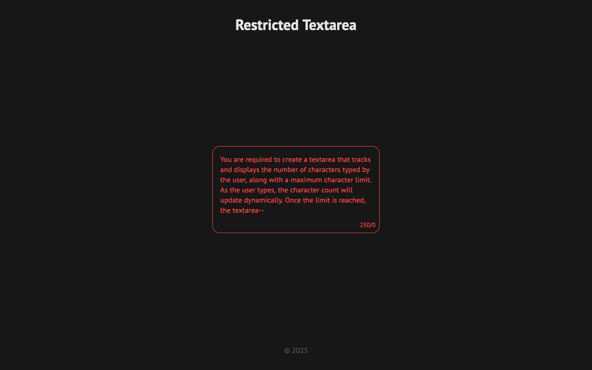

# roadmap.sh

## Table of Contents

### Frontend

<table>
  <thead>
    <tr>
      <th>No.</th>
      <th>Live</th>
      <th>Code</th>
      <th>Project Link</th>
    </tr>
  </thead>
  <tbody>
    <tr>
      <td>1</td>
      <td>
        
      </td>
      <td><a href="https://github.com/mouhany/roadmap.sh/tree/main/frontend/01-single-page-cv/">Single Page CV</a></td>
      <td><a href="https://roadmap.sh/projects/single-page-cv">https://roadmap.sh/projects/single-page-cv</a></td>
    </tr>
    <tr>
      <td>2</td>
      <td>
        
      </td>
      <td><a href="https://github.com/mouhany/roadmap.sh/tree/main/frontend/02-basic-html-website/">Basic HTML Website</a></td>
      <td><a href="https://roadmap.sh/projects/basic-html-website">https://roadmap.sh/projects/basic-html-website</a></td>
    </tr>
    <tr>
      <td>3</td>
      <td>
        
      </td>
      <td><a href="https://github.com/mouhany/roadmap.sh/tree/main/frontend/03-personal-portfolio/">Personal Portfolio</a></td>
      <td><a href="https://roadmap.sh/projects/portfolio-website">https://roadmap.sh/projects/portfolio-website</a></td>
    </tr>
    <tr>
      <td>4</td>
      <td>
        
      </td>
      <td><a href="https://github.com/mouhany/roadmap.sh/tree/main/frontend/04-changelog-component/">Changelog Component</a></td>
      <td><a href="https://roadmap.sh/projects/changelog-component">https://roadmap.sh/projects/changelog-component</a></td>
    </tr>
    <tr>
      <td>5</td>
      <td>
        
      </td>
      <td><a href="https://github.com/mouhany/roadmap.sh/tree/main/frontend/05-testimonial-cards/">Testimonial Cards</a></td>
      <td><a href="https://roadmap.sh/projects/testimonial-cards">https://roadmap.sh/projects/testimonial-cards</a></td>
    </tr>
    <tr>
      <td>6</td>
      <td>
        
      </td>
      <td><a href="https://github.com/mouhany/roadmap.sh/tree/main/frontend/06-datepicker-ui/">Datepicker UI</a></td>
      <td><a href="https://roadmap.sh/projects/datepicker-ui">https://roadmap.sh/projects/datepicker-ui</a></td>
    </tr>
    <tr>
      <td>7</td>
      <td>
        
      </td>
      <td><a href="https://github.com/mouhany/roadmap.sh/tree/main/frontend/07-accessible-form-ui/">Accessible Form UI</a></td>
      <td><a href="https://roadmap.sh/projects/accessible-form-ui">https://roadmap.sh/projects/accessible-form-ui</a></td>
    </tr>
    <tr>
      <td>8</td>
      <td>
        
      </td>
      <td><a href="https://github.com/mouhany/roadmap.sh/tree/main/frontend/08-image-grid-layout/">Image Grid Layout</a></td>
      <td><a href="https://roadmap.sh/projects/image-grid">https://roadmap.sh/projects/image-grid</a></td>
    </tr>
    <tr>
      <td>9</td>
      <td>
        
      </td>
      <td><a href="https://github.com/mouhany/roadmap.sh/tree/main/frontend/09-tooltip-ui/">Tooltip UI</a></td>
      <td><a href="https://roadmap.sh/projects/tooltip-ui">https://roadmap.sh/projects/tooltip-ui</a></td>
    </tr>
    <tr>
      <td>10</td>
      <td>
        
      </td>
      <td><a href="https://github.com/mouhany/roadmap.sh/tree/main/frontend/10-tabs/">Tabs</a></td>
      <td><a href="https://roadmap.sh/projects/simple-tabs">https://roadmap.sh/projects/simple-tabs</a></td>
    </tr>
    <tr>
      <td>11</td>
      <td>
        
      </td>
      <td><a href="https://github.com/mouhany/roadmap.sh/tree/main/frontend/11-cookie-consent/">Cookie Consent</a></td>
      <td><a href="https://roadmap.sh/projects/cookie-consent">https://roadmap.sh/projects/cookie-consent</a></td>
    </tr>
    <tr>
      <td>12</td>
      <td>
        
      </td>
      <td><a href="https://github.com/mouhany/roadmap.sh/tree/main/frontend/12-restricted-textarea/">Restricted Textarea</a></td>
      <td><a href="https://roadmap.sh/projects/restricted-textarea">https://roadmap.sh/projects/restricted-textarea</a></td>
    </tr>
    <tr>
      <td>13</td>
      <td>
        
      </td>
      <td><a href="https://github.com/mouhany/roadmap.sh/tree/main/frontend/13-accordion/">Accordion</a></td>
      <td><a href="https://roadmap.sh/projects/accordion">https://roadmap.sh/projects/accordion</a></td>
    </tr>
    <tr>
      <td>14</td>
      <td>
        
      </td>
      <td><a href="https://github.com/mouhany/roadmap.sh/tree/main/frontend/14-age-calculator/">Age Calculator</a></td>
      <td><a href="https://roadmap.sh/projects/age-calculator">https://roadmap.sh/projects/age-calculator</a></td>
    </tr>
    <tr>
      <td>15</td>
      <td>
        
      </td>
      <td><a href="https://github.com/mouhany/roadmap.sh/tree/main/frontend/15-flash-cards/">Flash Cards</a></td>
      <td><a href="https://roadmap.sh/projects/flash-cards">https://roadmap.sh/projects/flash-cards</a></td>
    </tr>
  </tbody>
</table>
