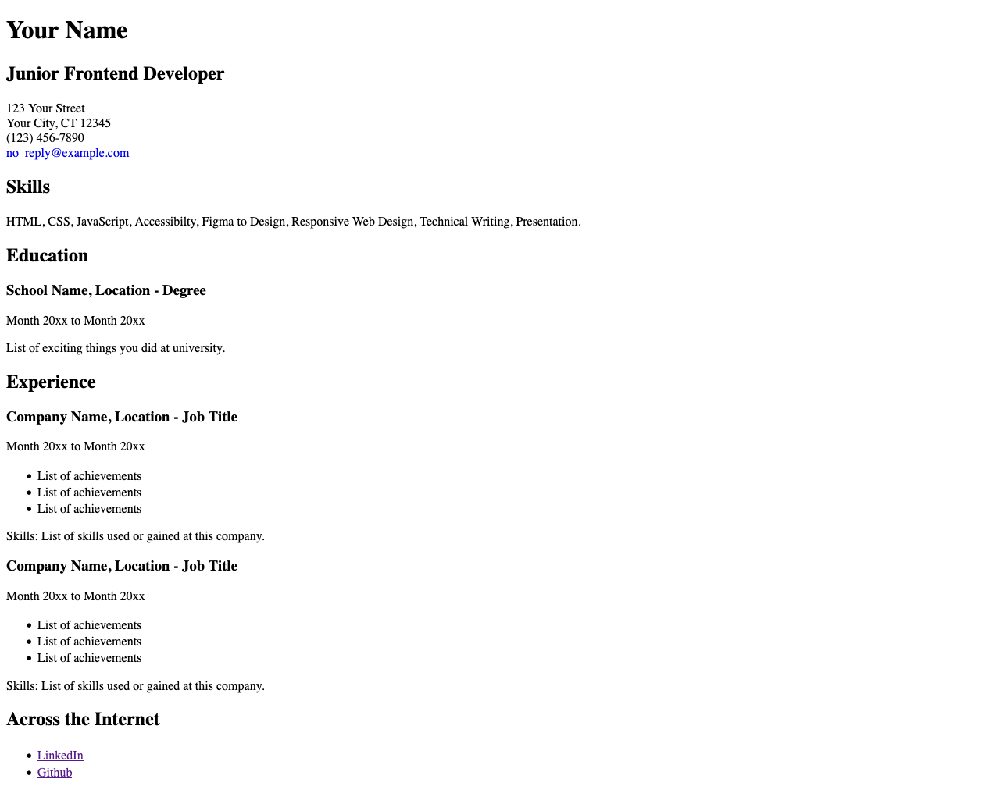

# Single Page CV

Link: https://roadmap.sh/projects/single-page-cv

## Key requirements:

- Semantically correct HTML structure.
- Single-page layout with sections for education, skills, and career history.
- SEO meta tags in the head section.
- OG tags for better social media sharing.
- A favicon linked in the head section.

## Preview

