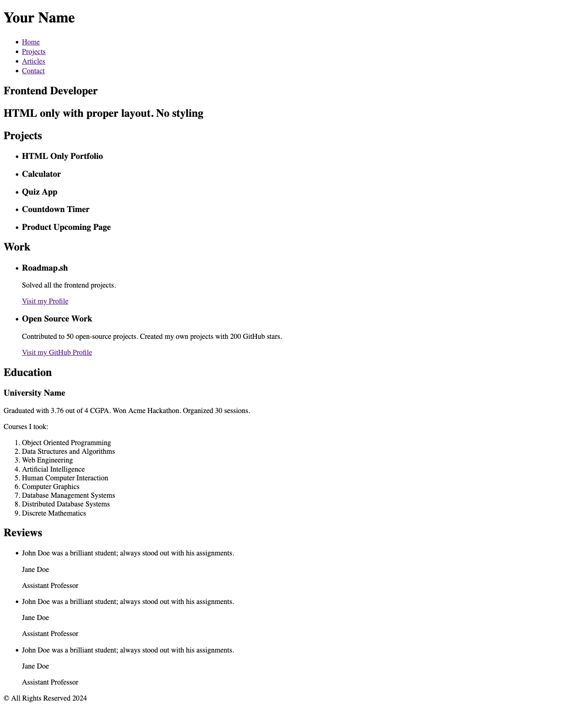

# Basic HTML Website

Live: https://mouhany.github.io/roadmap.sh/frontend/02-basic-html-website/

## Key requirements:

- Should have the following pages: Homepage, Projects, Articles, and Contact.
- Semantically correct HTML structure.
- Multiple pages with a navigation bar.
- SEO meta tags in the head of each page.
- Contact page should have a form with fields like name, email, message etc.

## Preview

| Page     | Preview                                                     |
| -------- | ----------------------------------------------------------- |
| Index    |              |
| Projects |  |
| Articles |  |
| Contact  |    |
