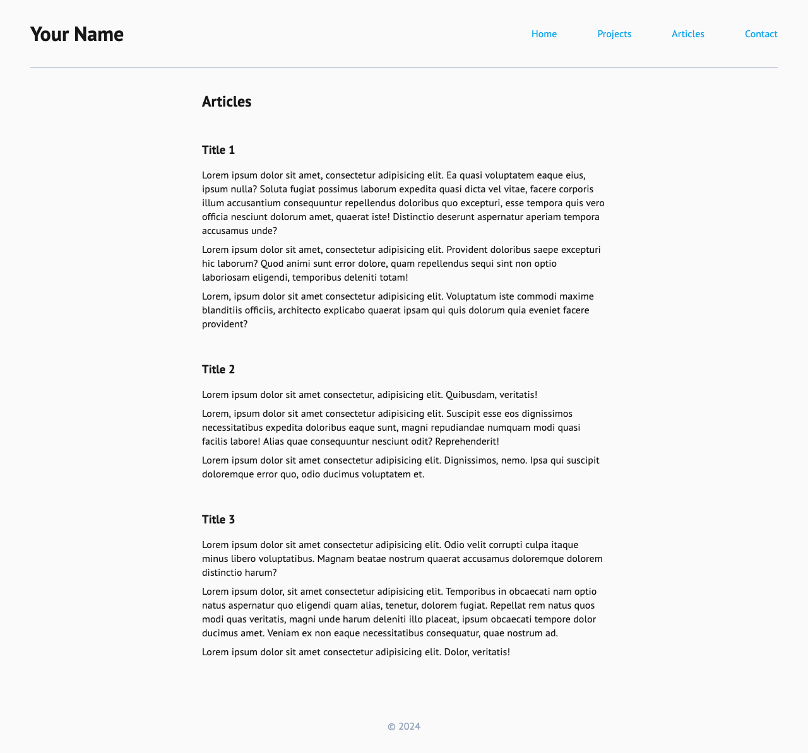
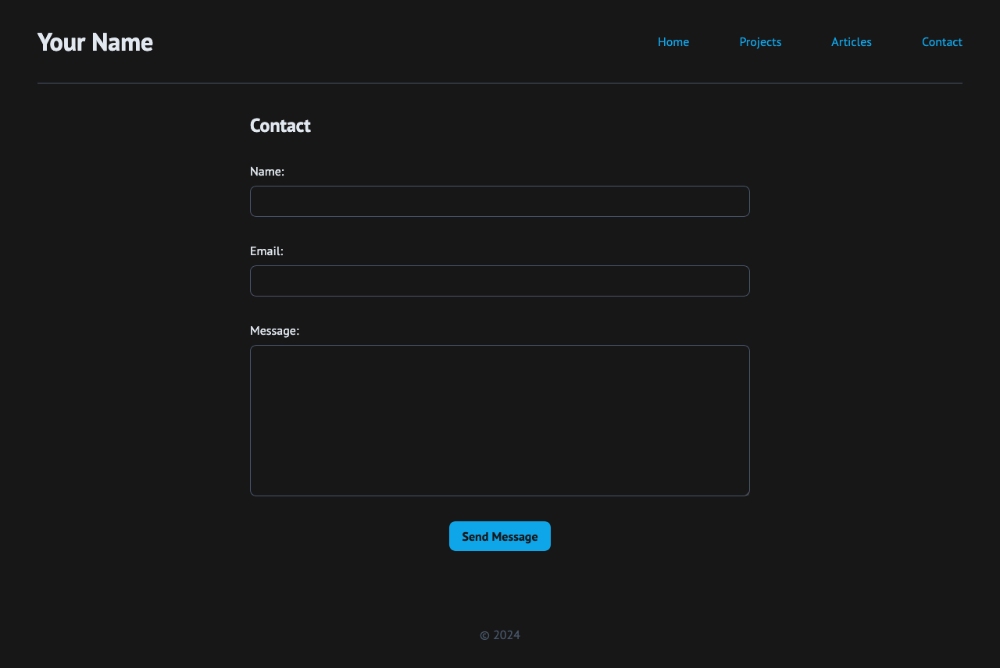

# Personal Portfolio

Live: https://mouhany.github.io/roadmap.sh/frontend/03-portfolio-website/

## Key requirements:

- A fully styled, responsive website with the same structure as the previous project.
- Consistent use of a chosen color scheme and typography.
- Proper use of CSS techniques like Flexbox, media queries, and the box model.
- A responsive navigation bar and well-styled contact form.

## Bonus Points

- Use Google Fonts to enhance the typography of your website.
- Look into GitHub Pages or Cloudflare Pages to host your website for free.
- Add support for dark mode using CSS variables.

## Preview

### 24-inch Desktop Screen

| Page     | Preview Light                                             | Preview Dark                                            |
| -------- | --------------------------------------------------------- | ------------------------------------------------------- |
| Index    |        |        |
| Projects |  |  |
| Articles |  |  |
| Contact  |    |    |

### 13-inch Laptop Screen

| Page     | Preview Light                                            | Preview Dark                                           |
| -------- | -------------------------------------------------------- | ------------------------------------------------------ |
| Index    |        |        |
| Projects |  |  |
| Articles |  |  |
| Contact  |    |    |

### Tablet Screen

| Page     | Preview Light                                            | Preview Dark                                           |
| -------- | -------------------------------------------------------- | ------------------------------------------------------ |
| Index    |        |        |
| Projects |  |  |
| Articles |  |  |
| Contact  |    |    |

### Mobile Screen

| Page     | Preview Light                                            | Preview Dark                                           |
| -------- | -------------------------------------------------------- | ------------------------------------------------------ |
| Index    |        |        |
| Projects |  |  |
| Articles |  |  |
| Contact  |    |    |
