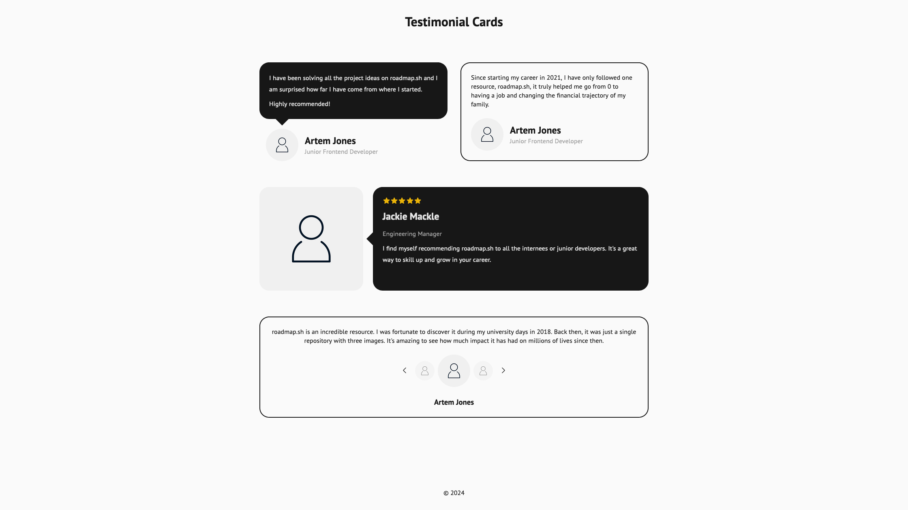
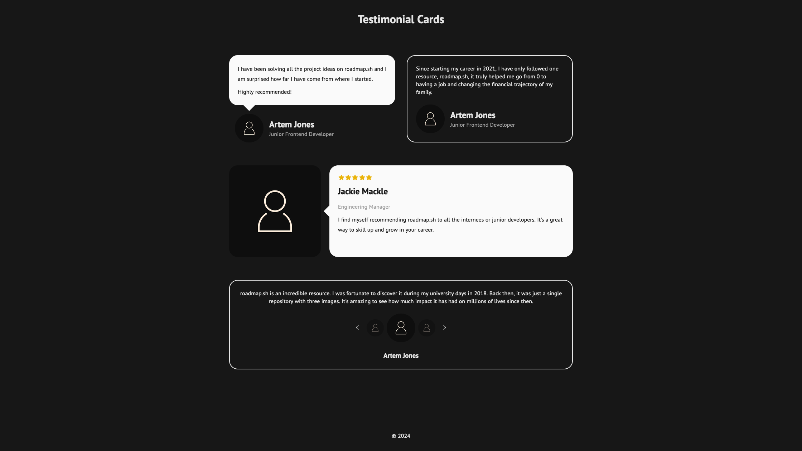
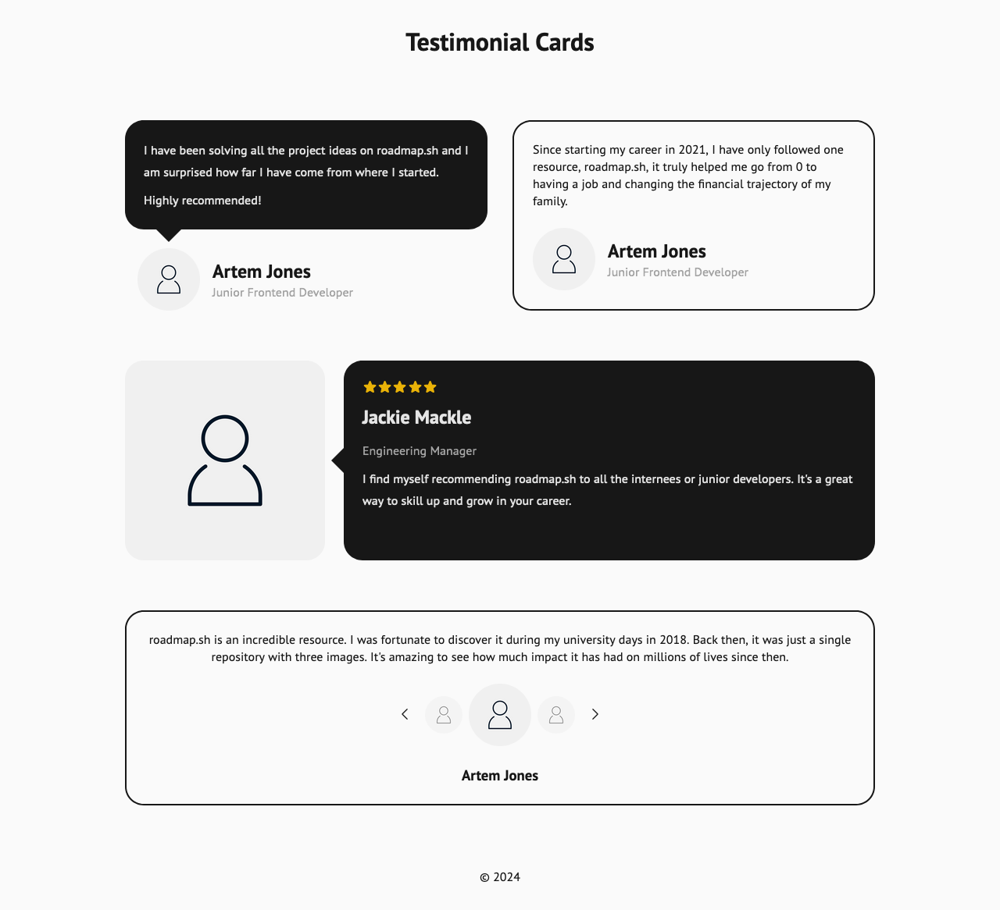
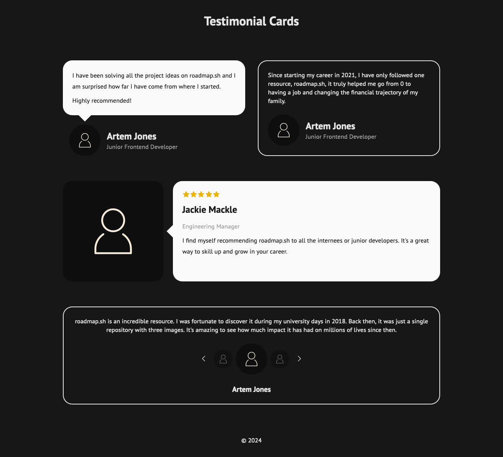
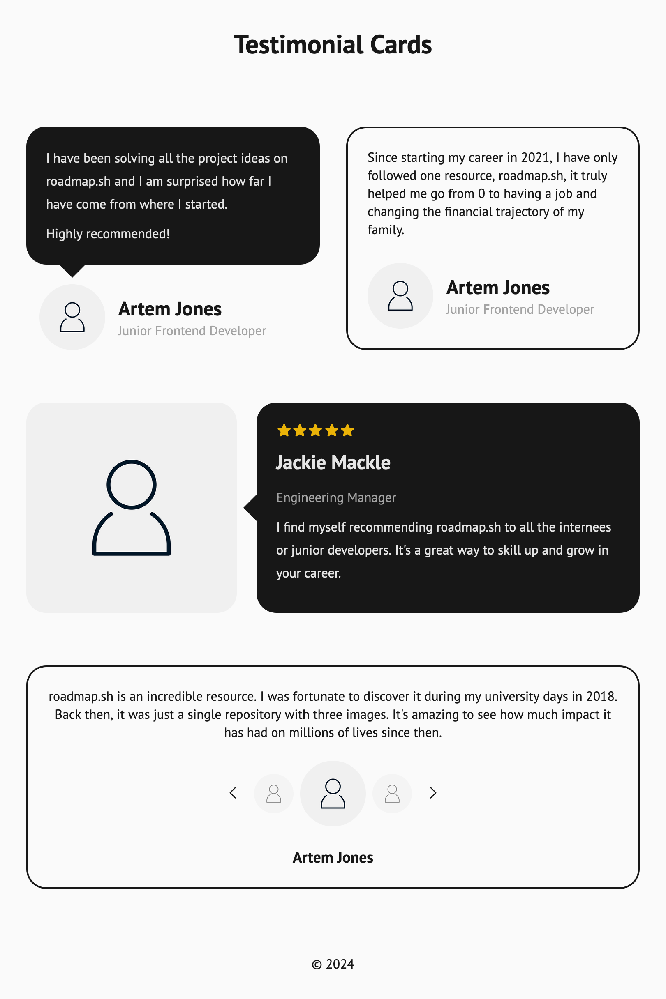
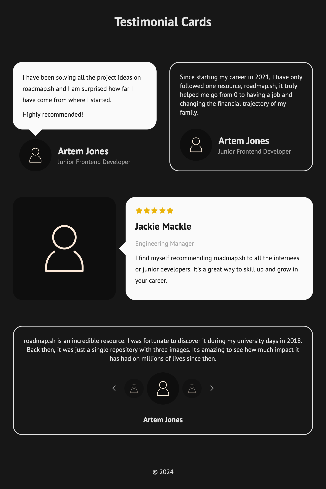
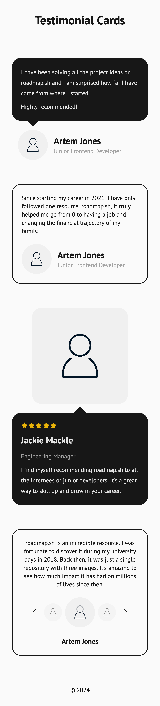
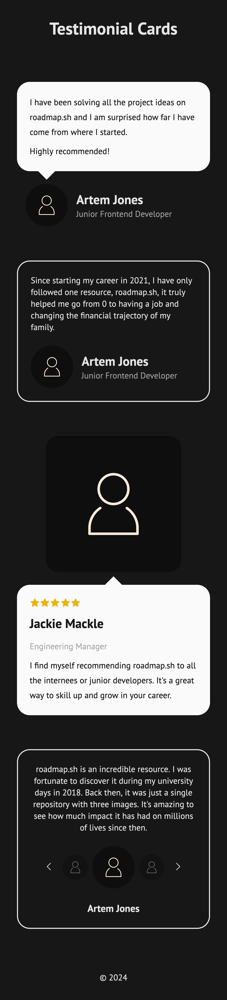

# Testimonial Cards

Live: https://mouhany.github.io/roadmap.sh/frontend/05-testimonial-cards/

## Key Requirements:

- Create multiple styled testimonial cards for a website.
- Each card should include a quote, the author’s name, and optionally an image.
- Use CSS for layout, positioning, and responsive design.
- Apply techniques like Flexbox or Grid for card alignment and spacing.
- Ensure the design adapts to various screen sizes.

## Preview

| Screen                 | Preview Light                                   | Preview Dark                                  |
| ---------------------- | ----------------------------------------------- | --------------------------------------------- |
| 24-inch Desktop Screen |  |  |
| 13-inch Laptop Screen  |    |    |
| Tablet Screen          |    |    |
| Mobile Screen          |    |    |
