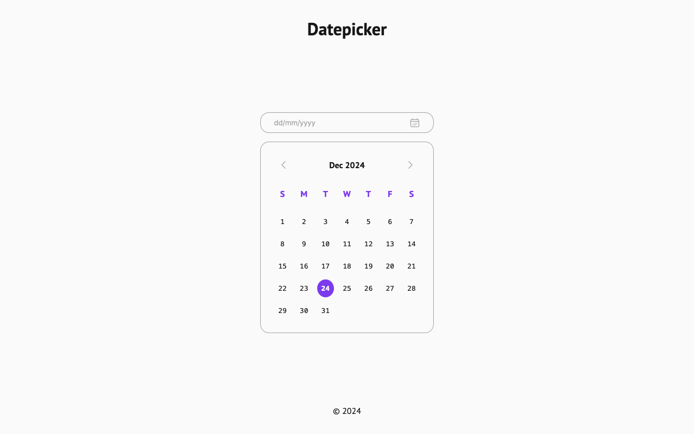
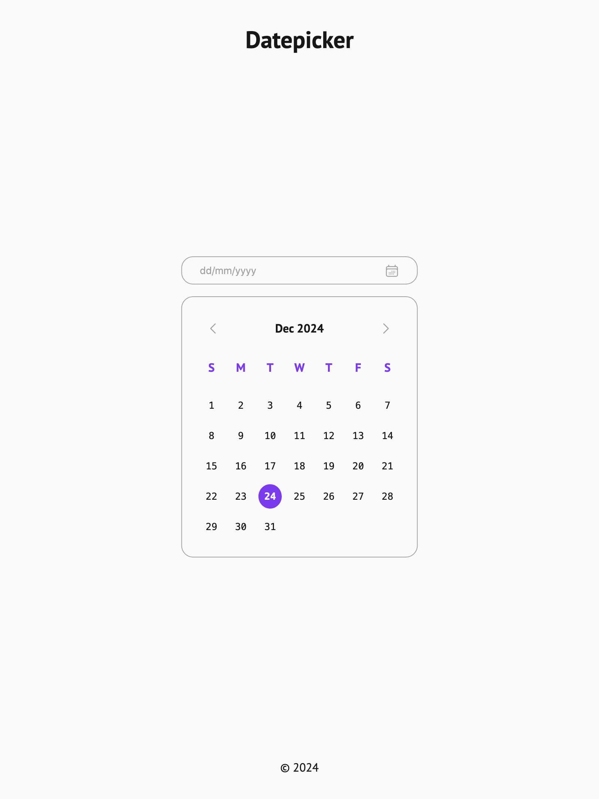
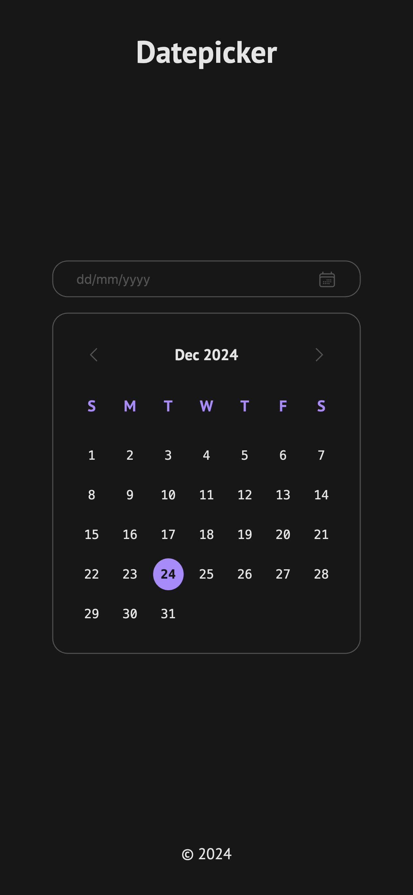

# Datepicker UI

Live: https://mouhany.github.io/roadmap.sh/frontend/06-datepicker-ui/

## Key Requirements:

- Create a static datepicker UI with days of the week and selectable dates using only HTML and CSS.
- Apply techniques like Flexbox or Grid for the calendar structure.
- Ensure the design is responsive and adapts to different screen sizes.

## Preview

| Screen                 | Preview Light                                   | Preview Dark                                  |
| ---------------------- | ----------------------------------------------- | --------------------------------------------- |
| 24-inch Desktop Screen |  |  |
| 13-inch Laptop Screen  |    |    |
| Tablet Screen          |    |    |
| Mobile Screen          |    |    |
