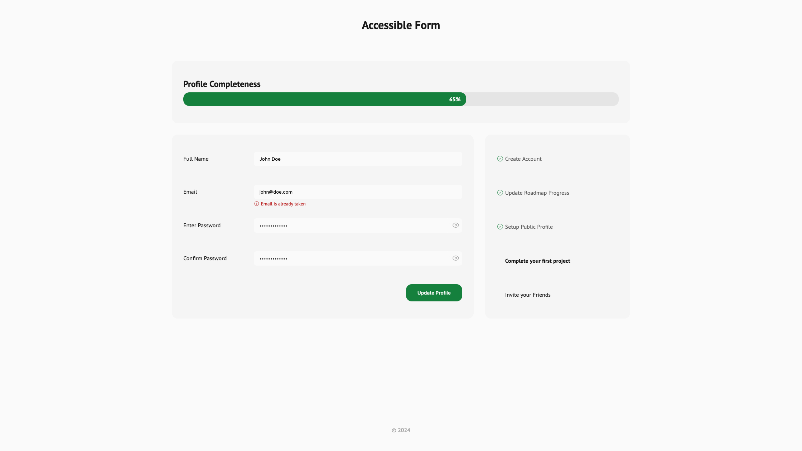
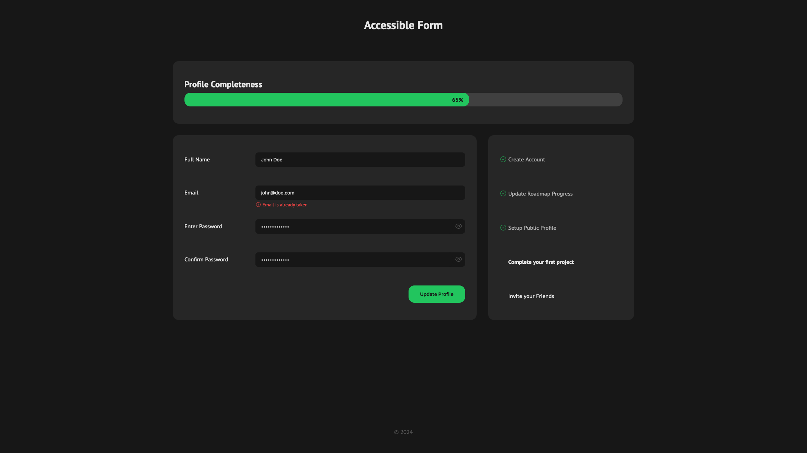
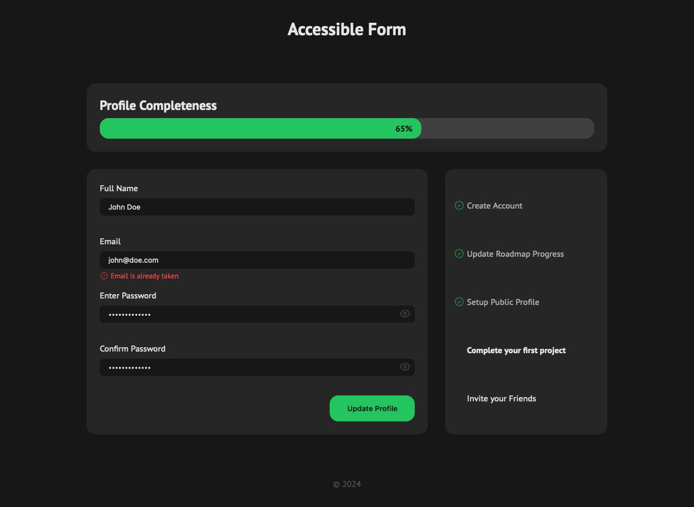
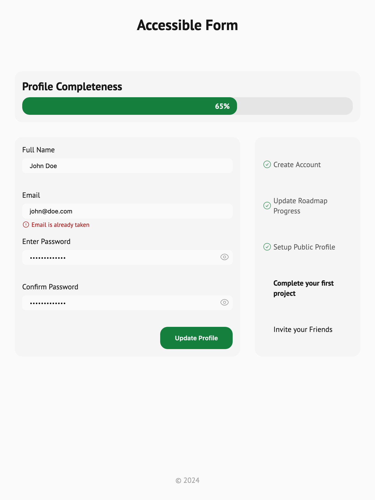
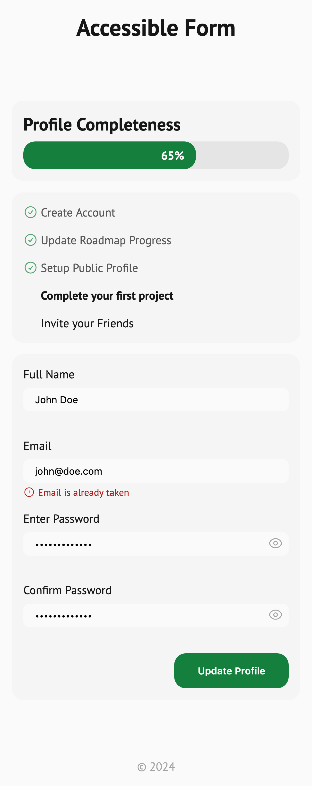
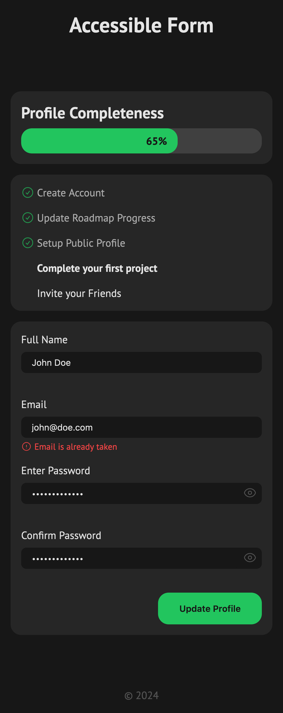

# Accessible Form UI

Live: https://mouhany.github.io/roadmap.sh/frontend/07-accessible-form-ui/

## Key Requirements:

- Build a static form UI with fields for:
  - name
  - email
  - password
  - confirm password
  - a password toggle button
  - a progress bar
  - a checklist
- Use `<label>` elements, ARIA attributes, and proper focus states for accessibility.
- Ensure clear error messaging and sufficient color contrast.
- Style the form using CSS with Flexbox or Grid for layout.
- Make the design responsive and customizable.
- Test accessibility using tools like screen readers, Axe, or Lighthouse.

## Preview

| Screen                 | Preview Light                                   | Preview Dark                                  |
| ---------------------- | ----------------------------------------------- | --------------------------------------------- |
| 24-inch Desktop Screen |  |  |
| 13-inch Laptop Screen  |    |    |
| Tablet Screen          |    |    |
| Mobile Screen          |    |    |
