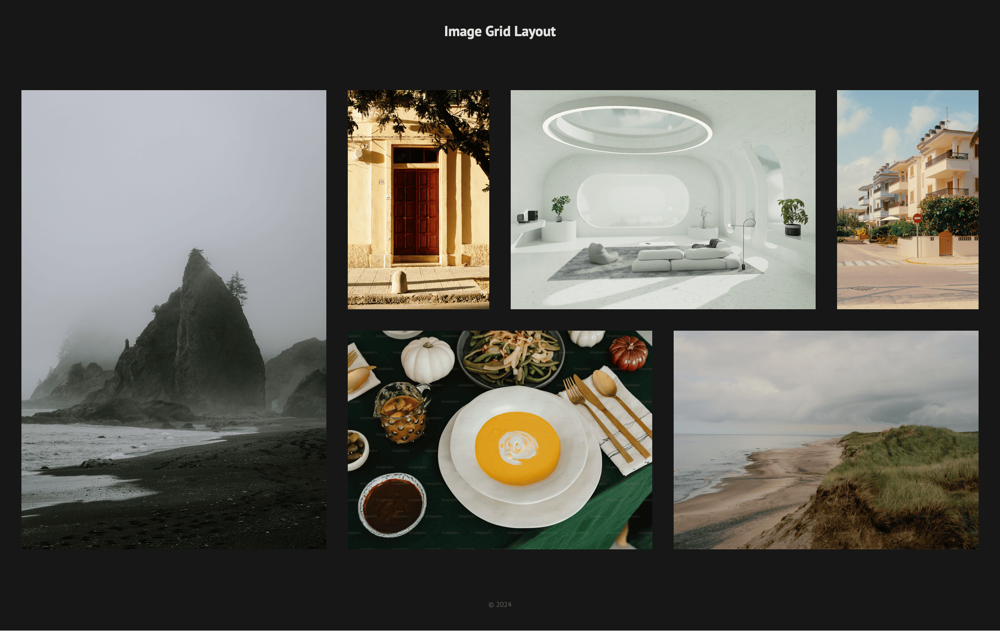

# Image Grid Layout

Live: https://mouhany.github.io/roadmap.sh/frontend/08-image-grid/

## Key Requirements:

- Create a grid layout for six images (3 portrait and 3 landscape images) using CSS Grid.
- Ensure the layout is responsive and adapts to different screen sizes.
- Use spacing and alignment for a clean design.
- Include semantic HTML and alt text for accessibility.

## Preview

| Screen                 | Preview Light                                   | Preview Dark                                  |
| ---------------------- | ----------------------------------------------- | --------------------------------------------- |
| 24-inch Desktop Screen |  |  |
| 13-inch Laptop Screen  |    |    |
| Tablet Screen          |    |    |
| Mobile Screen          |    |    |
