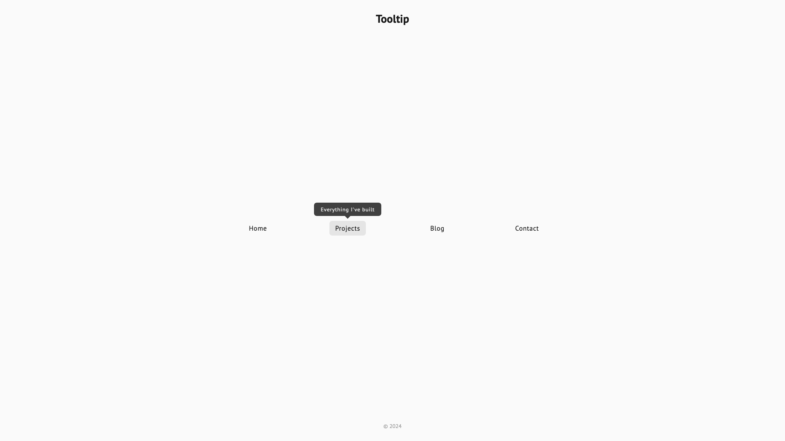
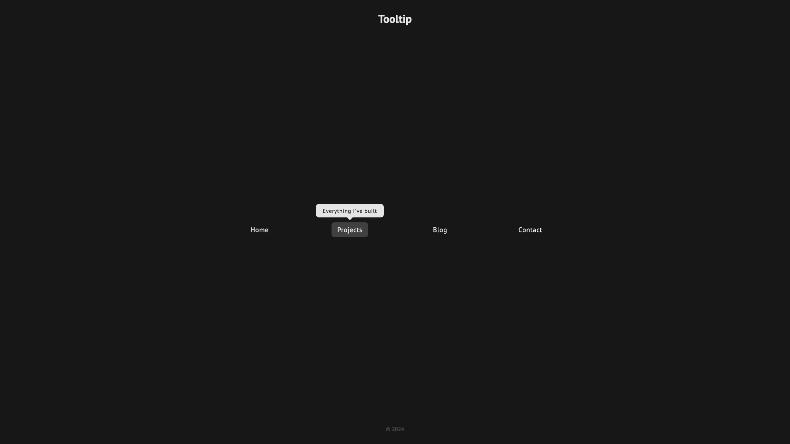
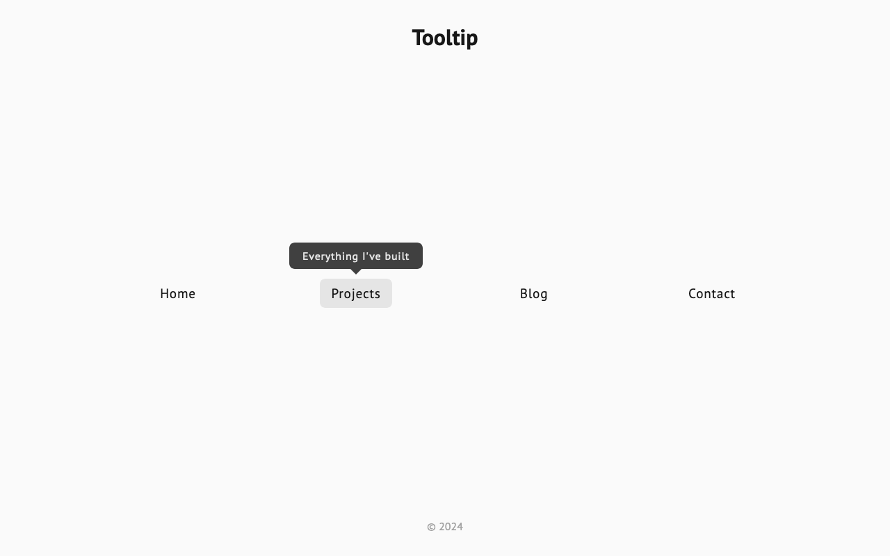
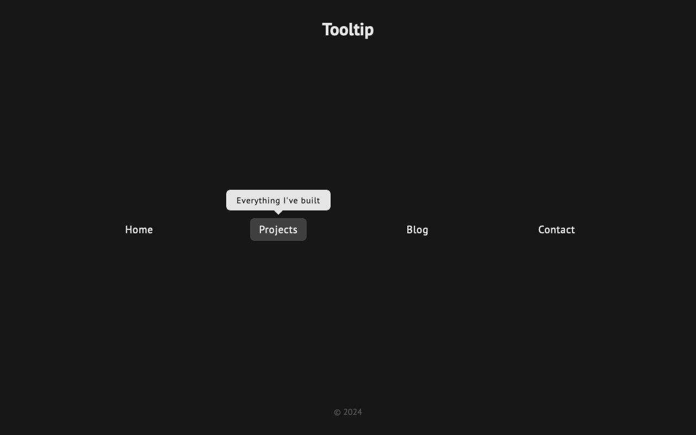
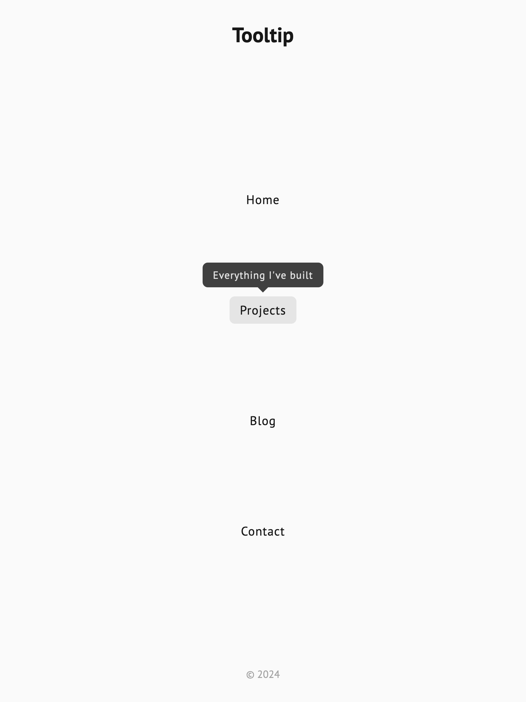
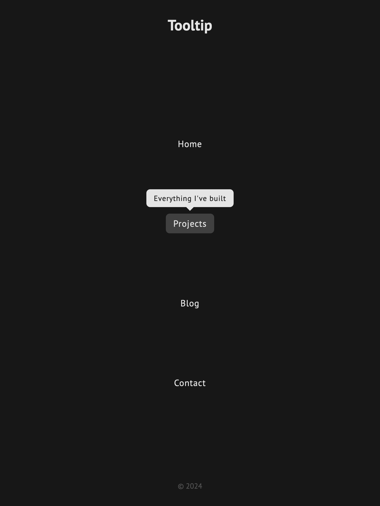
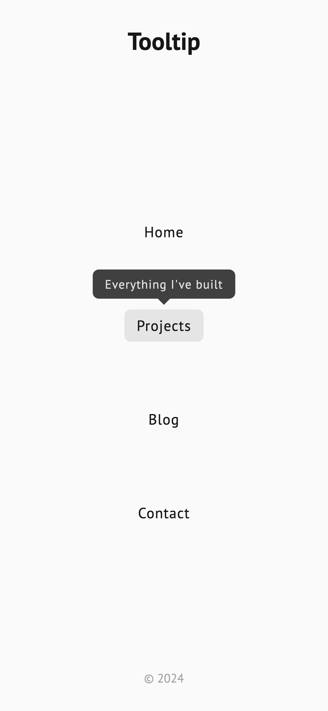
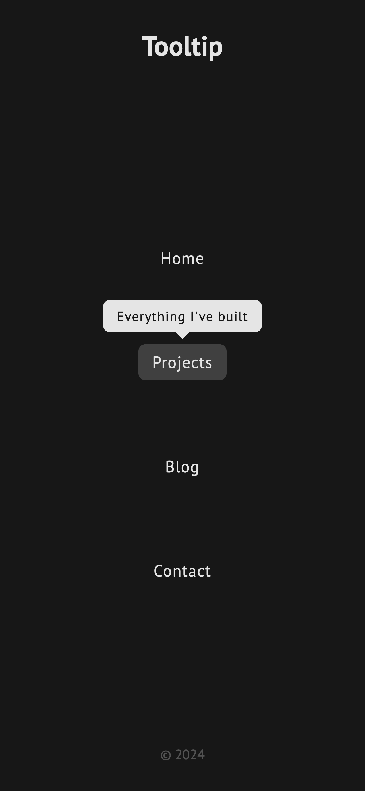

# Tooltip UI

Link: https://roadmap.sh/projects/tooltip-ui

## Key Requirements:

- Create a tooltip that appears above navigation items when hovered, using only HTML and CSS.
- Use CSS positioning and hover effects to display the tooltip.
- Ensure smooth transitions for the tooltip's appearance.
- Bonus: Add animations like fade-in, slide-in, or scale-in.
- Focus on creating interactive UI elements without JavaScript.

## Preview

| Screen                 | Preview Light                                   | Preview Dark                                  |
| ---------------------- | ----------------------------------------------- | --------------------------------------------- |
| 24-inch Desktop Screen |  |  |
| 13-inch Laptop Screen  |    |    |
| Tablet Screen          |    |    |
| Mobile Screen          |    |    |
