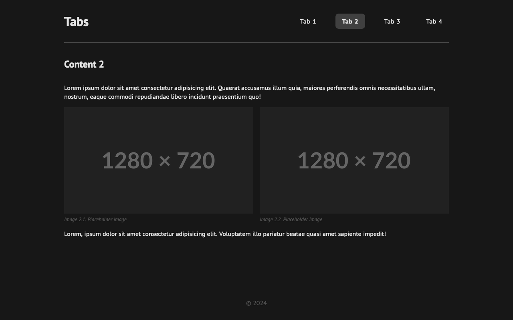

# Tabs

## Key Requirements:

- Create a simple tabs functionality using HTML, CSS, and JavaScript.
- Display four tabs, with the first tab active by default.
- Hide the current tab's content and display the selected tab's content on click.
- Use JavaScript to select elements, handle click events, and manipulate the DOM.

## Preview

| Screen                 | Preview Light                                    | Preview Dark                                   |
| ---------------------- | ------------------------------------------------ | ---------------------------------------------- |
| 24-inch Desktop Screen |  |  |
| 13-inch Laptop Screen  |    |    |
| Tablet Screen          |    |    |
| Mobile Screen          |    |    |
