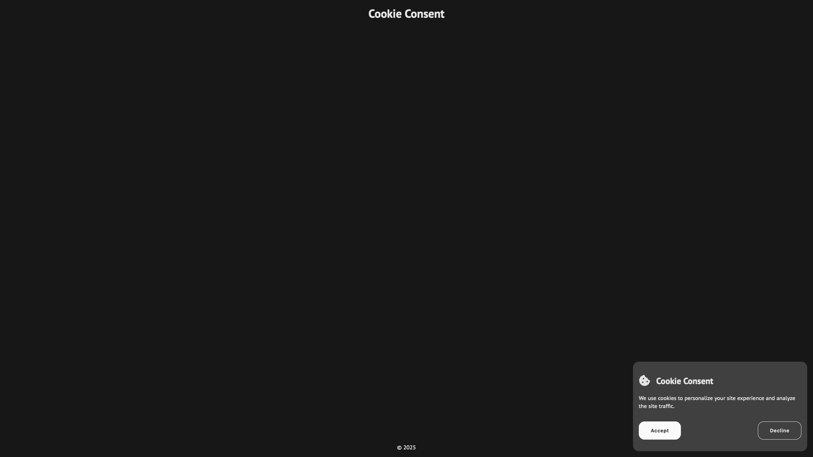
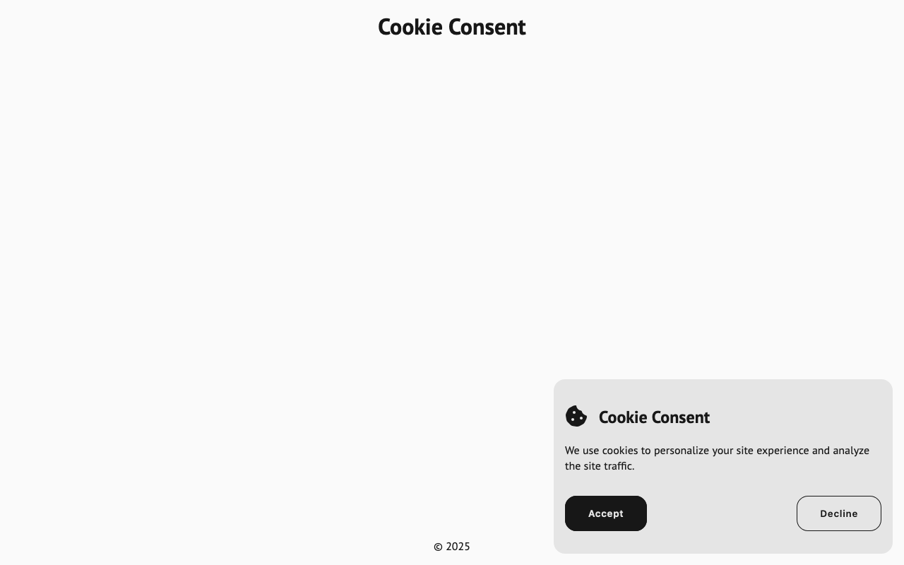
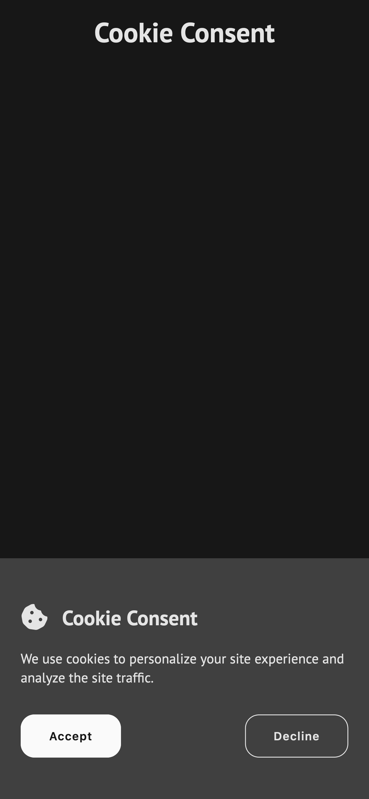

# Cookie Consent

Link: https://roadmap.sh/projects/cookie-consent

## Key Requirements:

- Create a cookie consent banner that appears when the page loads.
- Include a message and a button to accept consent.
- Make the banner disappear after consent is given.
- Use JavaScript for DOM manipulation and event handling.
- Bonus: Persist consent using cookies or local storage to prevent the banner from reappearing.

## Preview

| Screen                 | Preview Light                                    | Preview Dark                                   |
| ---------------------- | ------------------------------------------------ | ---------------------------------------------- |
| 24-inch Desktop Screen |  |  |
| 13-inch Laptop Screen  |    |    |
| Tablet Screen          |    |    |
| Mobile Screen          |    |    |
