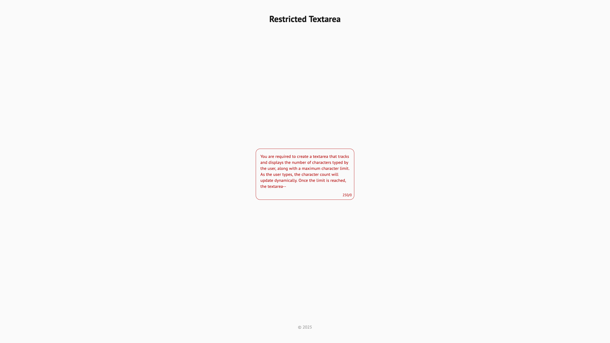
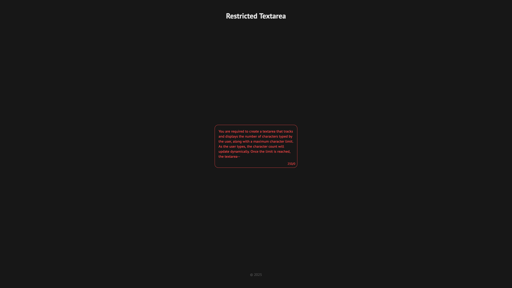
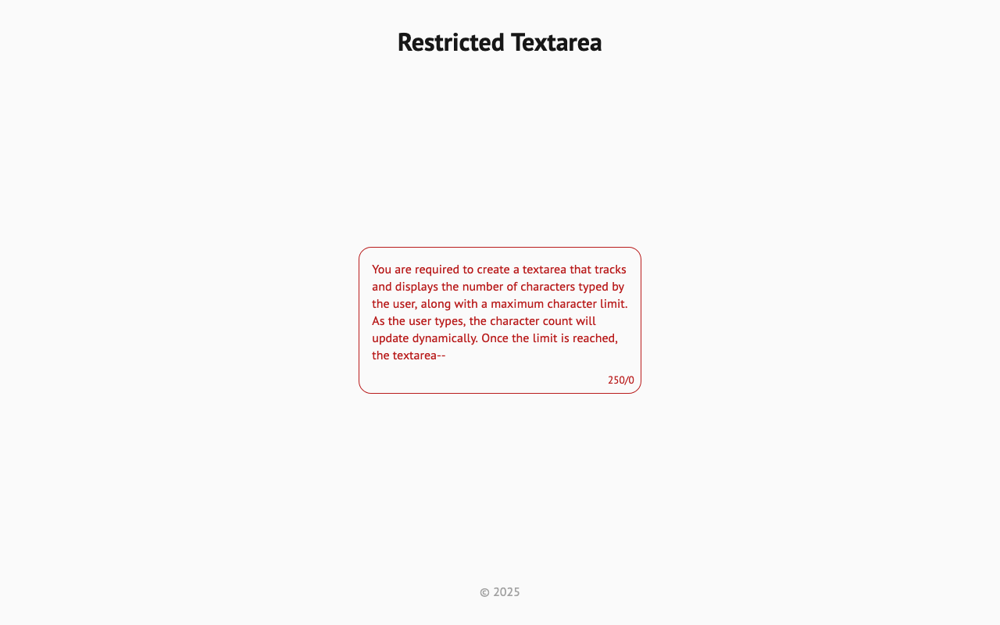
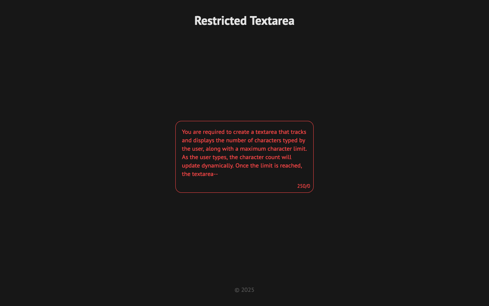
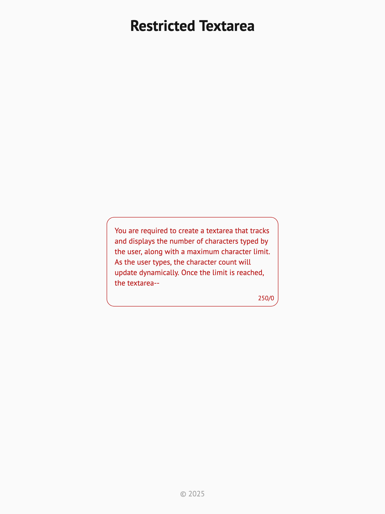
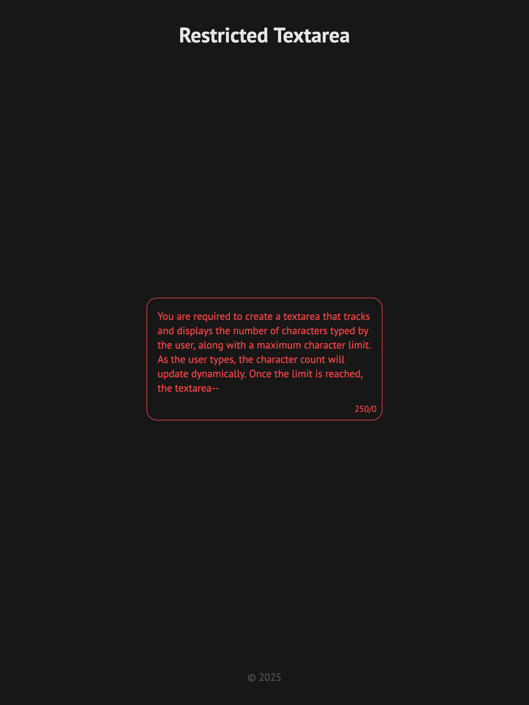
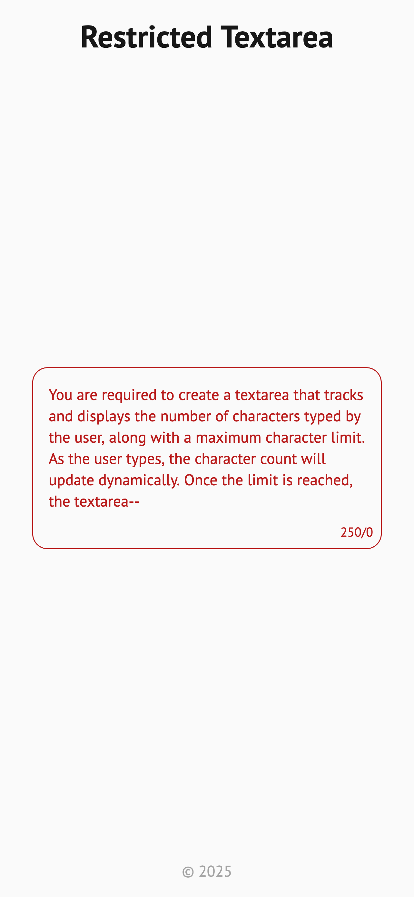
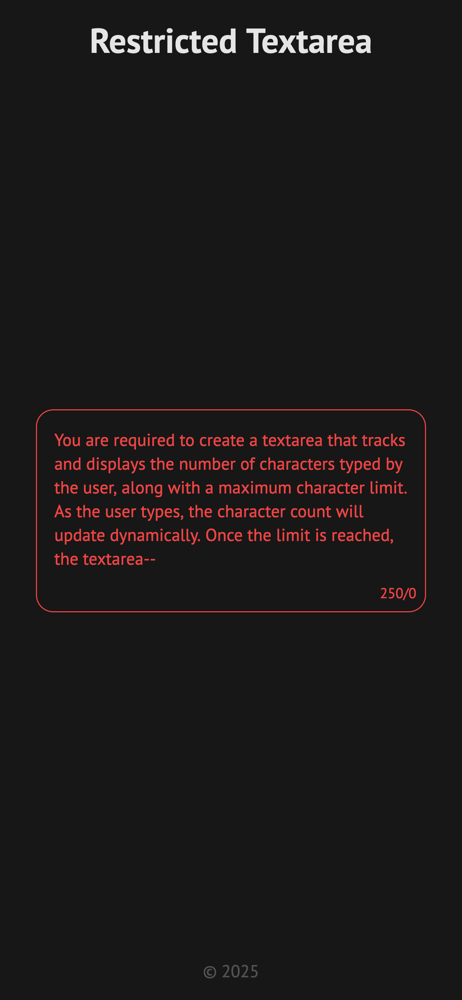

# Restricted Textarea

Live: https://mouhany.github.io/roadmap.sh/frontend/12-restricted-textarea/

## Key Requirements:

- Create a textarea element that dynamically displays the live character count below it.
- Set a maximum character limit & prevent further input once the limit is reached.
- Change the textarea's border color to red when the maximum limit is reached.
- Use JavaScript to handle input events and update the character count in real time.

## Preview

| Screen                 | Preview Light                                    | Preview Dark                                   |
| ---------------------- | ------------------------------------------------ | ---------------------------------------------- |
| 24-inch Desktop Screen |  |  |
| 13-inch Laptop Screen  |    |    |
| Tablet Screen          |    |    |
| Mobile Screen          |    |    |
