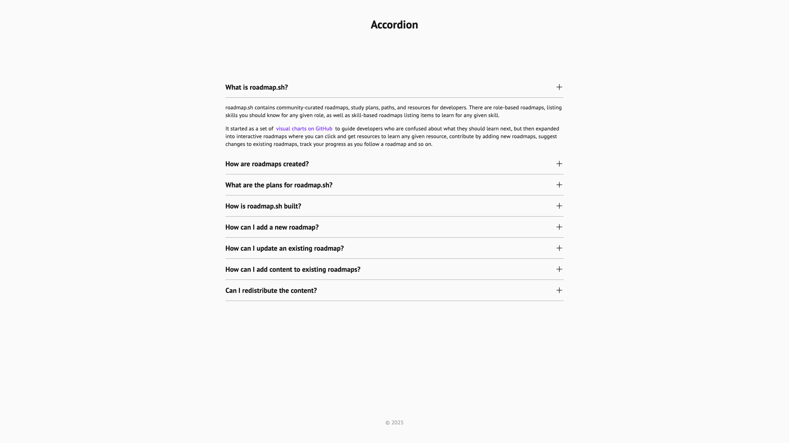
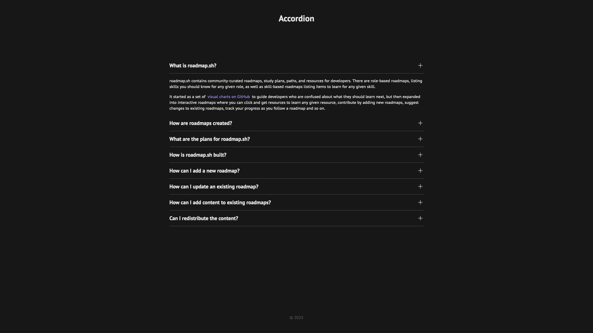
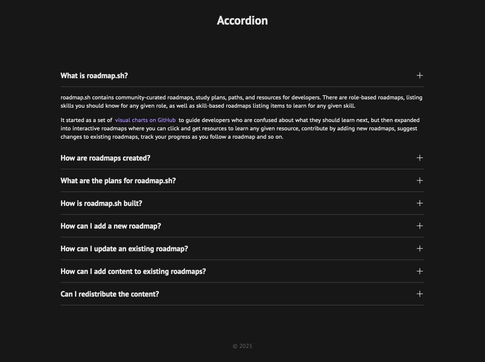
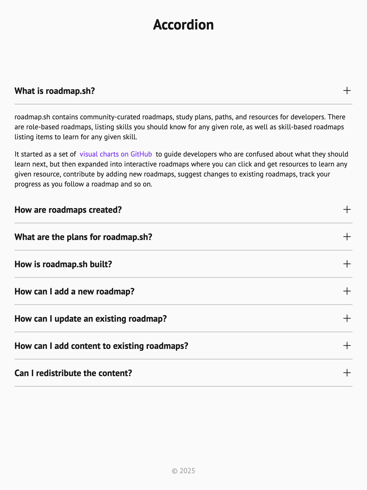
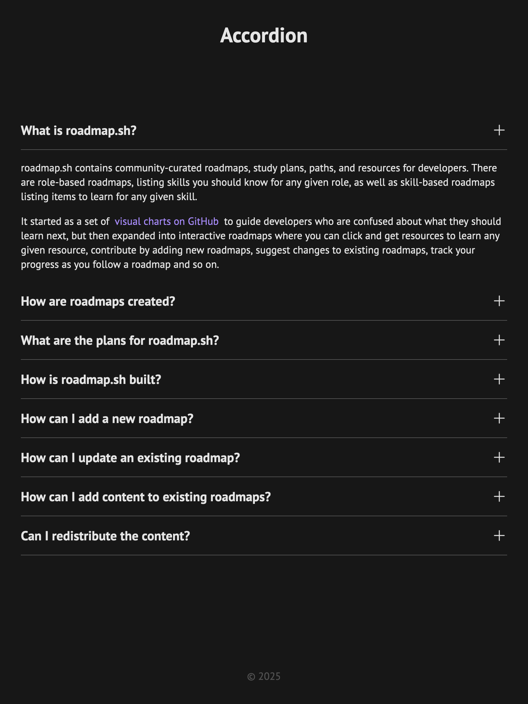
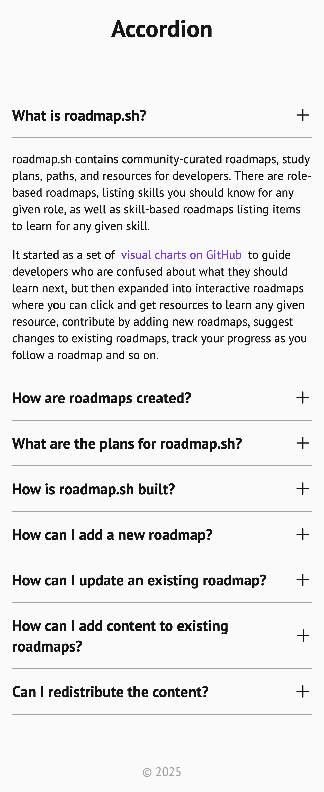
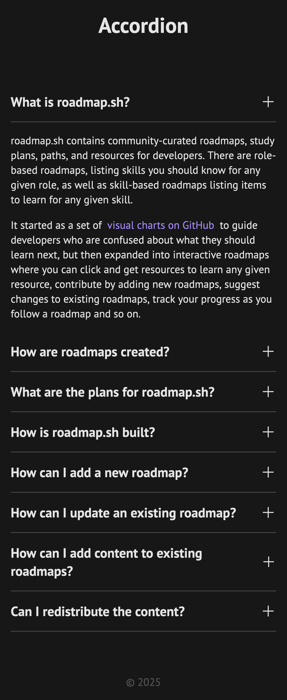

# Accordion

Live: https://mouhany.github.io/roadmap.sh/frontend/13-accordion/

## Key Requirements:

- Create an accordion component with multiple headings (questions) and their corresponding content (answers).
- Only one section should remain open at a time; opening a new section collapses the previously opened one.
- Use JavaScript to handle click events and toggle the display of content dynamically.
- Ensure the accordion is responsive and visually clean.

## Preview

| Screen                 | Preview Light                                    | Preview Dark                                   |
| ---------------------- | ------------------------------------------------ | ---------------------------------------------- |
| 24-inch Desktop Screen |  |  |
| 13-inch Laptop Screen  |    |    |
| Tablet Screen          |    |    |
| Mobile Screen          |    |    |
