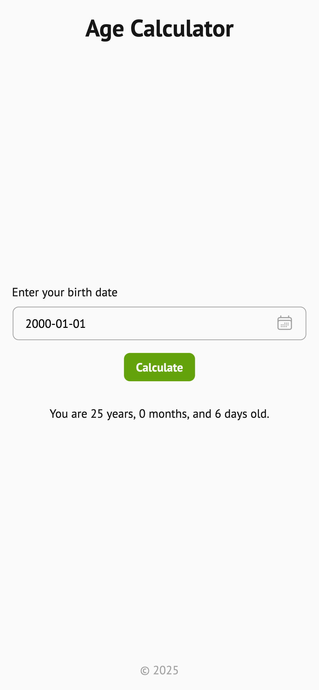

# Age Calculator

Live: https://mouhany.github.io/roadmap.sh/frontend/14-age-calculator/

## Key Requirements:

- Implement a JavaScript-based datepicker (not HTML) for the user to input their birthdate.
- Use the Luxon library to calculate the user's exact age in years, months, and days.
- Show the calculated age on the same page after the form is submitted.
- Ensure the birthdate is valid (e.g., not a future date or incomplete input).
- Apply basic, responsive styling to make the age calculator visually appealing and easy to use on different devices.

## Preview

| Screen                 | Preview Light                                    | Preview Dark                                   |
| ---------------------- | ------------------------------------------------ | ---------------------------------------------- |
| 24-inch Desktop Screen |  |  |
| 13-inch Laptop Screen  |    |    |
| Tablet Screen          |    |    |
| Mobile Screen          |    |    |
