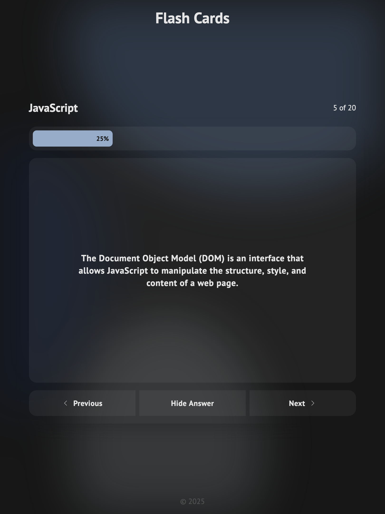
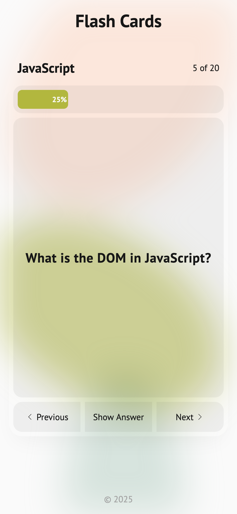

# Flash Cards

Live: https://mouhany.github.io/roadmap.sh/frontend/15-flash-cards/

## Key Requirements:

- Display pre-defined JavaScript flashcards with questions and answers.
- Allow users to flip flashcards to reveal answers.
- Provide navigation to cycle through flashcards one at a time.
- Show progress dynamically with a progress bar.
- Use a JavaScript framework (React, Angular, or Vue.js) for state management and reusable components.
- Ensure the design is responsive.

## Preview

| Screen                 | Preview Light                                    | Preview Dark                                   |
| ---------------------- | ------------------------------------------------ | ---------------------------------------------- |
| 24-inch Desktop Screen |  |  |
| 13-inch Laptop Screen  |    |    |
| Tablet Screen          |    |    |
| Mobile Screen          |    |    |

## Credit

CSS Plasma Background Generator: https://fracergu.github.io/css-plasma-background-generator/
