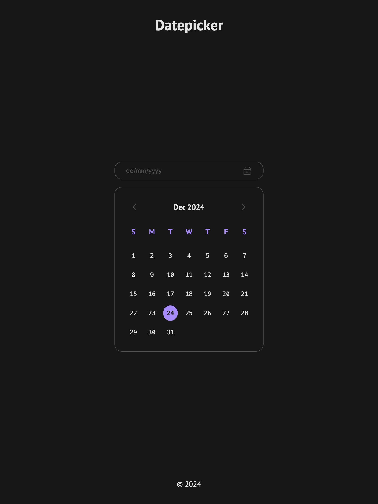

# Datepicker UI

## Key Requirements:

- Create a static datepicker UI with days of the week and selectable dates using only HTML and CSS.
- Apply techniques like Flexbox or Grid for the calendar structure.
- Ensure the design is responsive and adapts to different screen sizes.

## Preview

| Screen                 | Preview Light                                   | Preview Dark                                  |
| ---------------------- | ----------------------------------------------- | --------------------------------------------- |
| 24-inch Desktop Screen |  |  |
| 13-inch Laptop Screen  |   |   |
| Tablet Screen          |   |   |
| Mobile Screen          |   |   |
